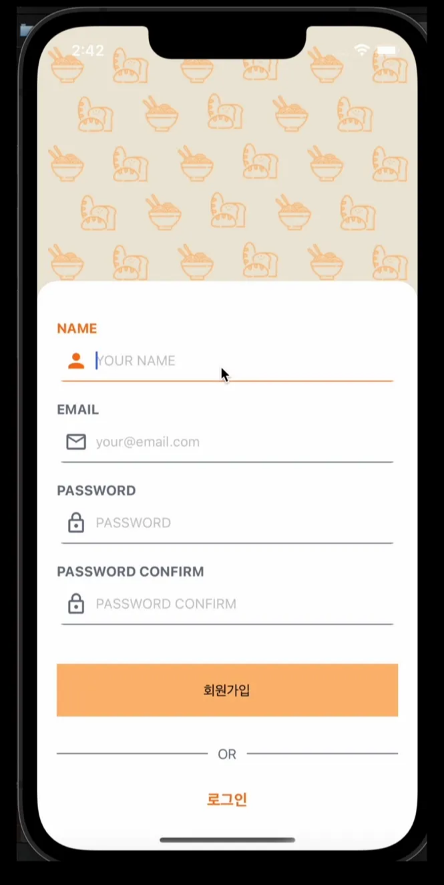
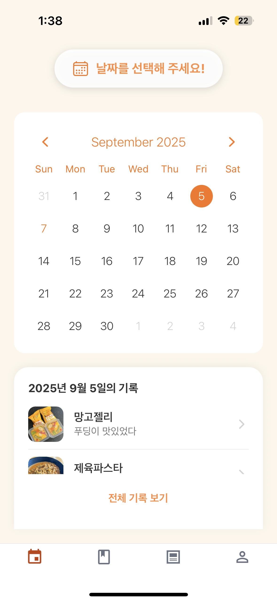
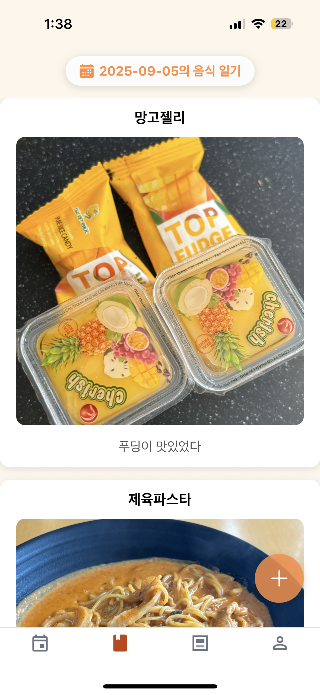
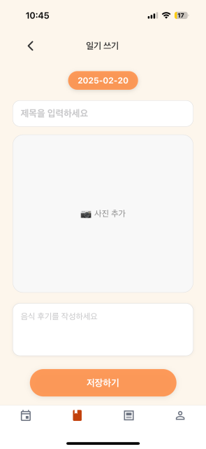
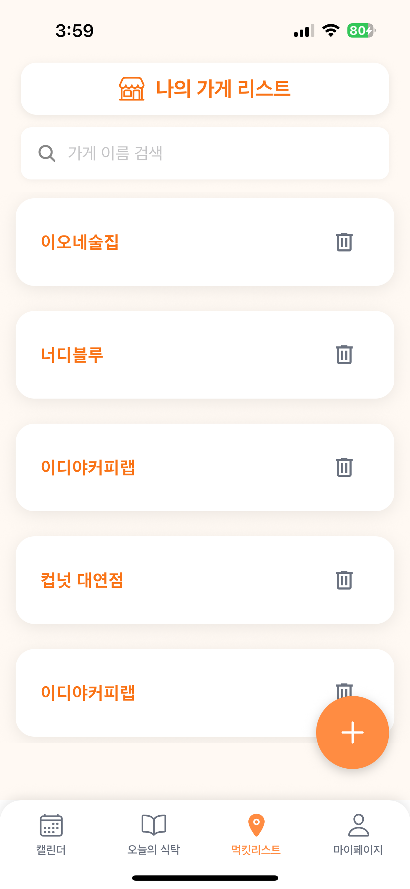
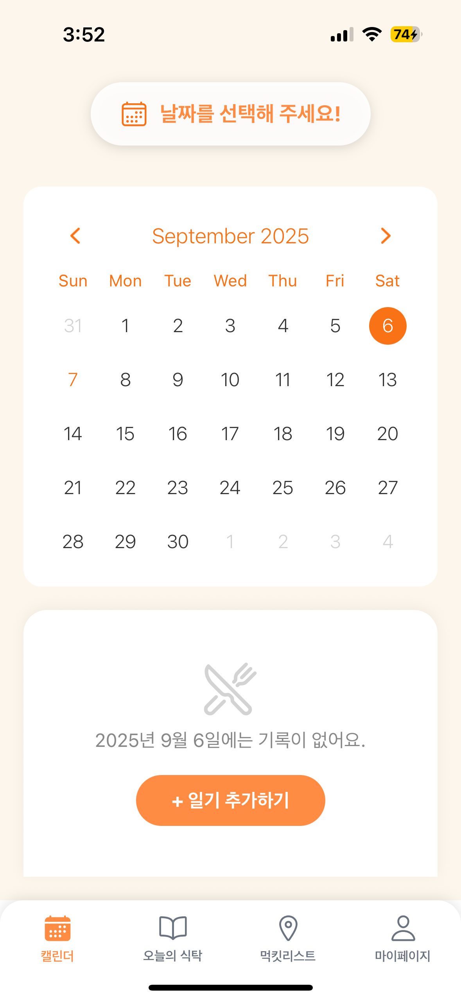

<div align="center">


# 🍽 FOTD (Food of the Day)

**음식과 함께하는 소중한 순간을 기록하는 푸드 다이어리 앱**

사진 · 메모 · 이모지 평점으로 나만의 음식 일기를 남기고, 가보고 싶은 맛집을 지도와 함께 관리하세요.

<br/>


</div>

---

## 목차

1. [프로젝트 개요](#1-프로젝트-개요)
2. [주요 기능](#2-주요-기능)
3. [화면 미리보기](#3-화면-미리보기)
4. [기술 스택](#4-기술-스택)
5. [시스템 아키텍처](#5-시스템-아키텍처)
6. [데이터 모델](#6-데이터-모델)
7. [API 명세](#7-api-명세)
8. [프로젝트 구조](#8-프로젝트-구조)
9. [실행 방법](#9-실행-방법)
10. [팀원 및 역할](#10-팀원-및-역할)

---

## 1. 프로젝트 개요

**FOTD**(Food of the Day)는 음식과 함께한 순간을 사진·메모·감정과 함께 기록하는 개인용 푸드 다이어리 모바일 앱입니다.

기존 서비스들이 리뷰 중심이거나 SNS처럼 공개적인 성격이 강했던 것과 달리, FOTD는 **개인적인 기록**에 초점을 맞췄습니다. 여행 중 먹었던 한 끼, 친구와 간 카페, 가족과의 식사처럼 음식과 연결된 추억을 편하게 남기고, 가보고 싶은 가게를 지도와 함께 모아둘 수 있습니다.

| | |
|---|---|
| **한 줄 소개** | 음식으로 기록하는 나만의 하루 |
| **플랫폼** | iOS / Android (React Native · Expo) |
| **팀 구성** | 5명 (프론트엔드 · 백엔드 · UI/UX) |

---

## 2. 주요 기능

### 🍽 음식 일기
맛있는 순간을 기록하는 나만의 푸드 다이어리
- 사진과 함께 제목·후기·날짜를 기록
- **이모지 평점**으로 그날 음식이 어땠는지 간단하게 표현
- 날짜 선택, 수정, 꾹 눌러서 삭제 지원

### 📅 캘린더 · 오늘의 식탁
- 캘린더에서 날짜를 고르면 그날의 음식 기록을 한눈에 확인
- **오늘의 식탁** 타임라인으로 최근 기록을 시간순으로 모아보기

### 📋 먹킷리스트
가보고 싶은 가게와 단골 맛집을 한곳에
- 가게를 검색해 리스트로 저장하고 관리
- **가고 싶음(WISHED) / 다녀옴(VISITED)** 상태 관리
- 먹킷리스트의 가게를 일기와 연동 - 다녀온 가게의 기록을 바로 남기기

### 🗺 지도 (카카오맵)
- 카카오 키워드 검색으로 가게를 찾아 위치 확인
- **Kakao Maps JS SDK를 WebView에 임베드**해 커스텀 지도 상세 화면 제공

### 👤 계정
- 이메일 회원가입 / 로그인 (비밀번호 bcrypt 해싱)
- 이메일 중복 확인, 마이페이지, 회원 탈퇴

---

## 3. 화면 미리보기

| 회원가입 | 캘린더 | 오늘의 식탁 |
|:---:|:---:|:---:|
|  |  |  |

| 일기 작성 | 먹킷리스트 | 마이페이지 |
|:---:|:---:|:---:|
|  |  |  |

> 🎬 시연 영상: _추후 추가 예정_

---

## 4. 기술 스택

| 분류 | 기술 |
|---|---|
| **Frontend** | React Native 0.79 · Expo SDK 53 · React 19 |
| **Navigation** | React Navigation (Native Stack · Bottom Tabs) |
| **상태 관리** | Context API + useReducer |
| **주요 라이브러리** | axios · react-native-webview · react-native-calendars · expo-image-picker · react-native-reanimated |
| **Backend** | Node.js · Express 5 |
| **ORM / DB** | Sequelize · MySQL (mysql2) |
| **인증** | bcrypt (비밀번호 해싱) |
| **외부 API** | Kakao Local API (키워드 검색) · Kakao Maps JS SDK |
| **개발 도구** | nodemon · sequelize-cli (migration) · ESLint · Prettier |

---

## 5. 시스템 아키텍처

```
┌─────────────────────────────┐         ┌──────────────────────────────┐
│   Mobile App (Expo / RN)    │         │   Backend (Express 5)        │
│                             │  REST   │                              │
│  Screens ─ Navigations      │ ──────▶ │  Routes ─ Controllers        │
│  Components ─ Context        │  axios  │        └ Services (business) │
│  WebView(Kakao Maps JS SDK) │ ◀────── │              └ Models (ORM)  │
└──────────────┬──────────────┘  JSON   └───────────────┬──────────────┘
               │                                         │
        Kakao Local API                            MySQL (Sequelize)
      (키워드 장소 검색)                          users · diaries · maps
```

**계층형 백엔드 설계** — `Route → Controller → Service → Model`로 책임을 분리해, 컨트롤러는 요청/응답만 담당하고 실제 비즈니스 로직과 DB 접근은 서비스·모델 계층으로 위임합니다. `app.js`(Express 설정)와 `server.js`(실행·DB 초기화)의 역할도 분리했습니다.

---

## 6. 데이터 모델

```
User (users)
 ├─ id · name · email · password(bcrypt)
 │
 ├──< Diary (diaries)          # 한 사용자의 여러 음식 일기
 │     id · date · title · content · image · rating(이모지) · muckitId(FK, nullable)
 │
 └──< Map (maps)              # 먹킷리스트(가게)
       id · name · address · x · y · status(ENUM: WISHED | VISITED)

Diary.muckitId ──▶ Map.id   (ON DELETE SET NULL)
  └ 먹킷리스트의 가게가 삭제돼도 작성한 일기는 보존
```

- **참조 무결성**: `Diary.userId → User`(CASCADE), `Diary.muckitId → Map`(SET NULL)로 설정해 사용자 삭제 시 일기까지 정리하되, 가게 삭제 시 일기는 남도록 설계
- **마이그레이션 기반 스키마 관리**: 초기 스키마 이후 `rating`, `maps.status`, `diaries.muckitId` 추가를 각각 마이그레이션 파일로 이력 관리


## 7. 프로젝트 구조

```
new-FOTD/
├── backend/
│   ├── app.js               # Express 앱 설정 (미들웨어 · 라우팅 · 에러 핸들러)
│   ├── server.js            # 서버 실행 · DB 초기화
│   ├── config/              # DB · 환경 설정
│   ├── routes/              # auth · users · diaries · muckits · maps
│   ├── controllers/         # 요청/응답 처리
│   ├── services/            # 비즈니스 로직
│   ├── models/              # Sequelize 모델 (user · diary · map)
│   └── migrations/          # 스키마 변경 이력
└── frontend/
    └── src/
        ├── Screens/         # Calendar · DiaryEntry · DiaryList · Timeline · Map · List · Profile · SignIn/Up
        ├── Components/      # 재사용 UI (Button · Input · List · DiaryItem · InputFAB ...)
        ├── Navigations/     # Auth · Main Stack · BottomTab · MapNavigation
        ├── Contexts/        # UserContext (로그인 상태)
        ├── Reducers/        # authFormReducer
        └── services/        # api.js (axios 설정)
```

---

## 8. 실행 방법

### Backend
```bash
cd backend
npm install
# .env 설정: DB_HOST, DB_USER, DB_PASSWORD, DB_NAME, PORT
npm start          # nodemon server.js
```

### Frontend
```bash
cd frontend
npm install
# .env 또는 config.js 에 Kakao REST API Key / JS Key 설정
npx expo start
```

> 백엔드 기본 포트 `3000`, 앱에서는 `src/config.js`의 API Base URL을 로컬 IP에 맞게 설정해야 합니다.

---

## 9. 팀원 및 역할

FOTD는 팀 프로젝트로 시작되었습니다.

- **2023 Initial Version**: 기능별로 역할을 분담하여 팀원들이 함께 개발했습니다.
- **2025 Reboot & Maintenance**: 프로젝트 백엔드 아키텍처 리팩토링과 기능 확장, 유지보수를 중심으로 진행했습니다.

| 이름 | 전공 | 역할 |
|------|------|------|
| 최혜인 | 컴퓨터공학과 | 팀장 · 프론트엔드 |
| 김지원 | 서비스디자인공학과 | UI/UX 디자인 |
| 나영은 | 컴퓨터공학과 | 백엔드 (2023), 프로젝트 리부트 · 백엔드 리팩토링 및 기능 개발 (2025) |
| 이가림 | 컴퓨터공학과 | 프론트엔드 · 백엔드 |
| 정주원 | 컴퓨터공학과 | 백엔드 |


### 👏 2023 Initial Version

기능별로 역할을 분담하여 함께 개발한 초기 버전입니다.

| 담당 | 팀원 | 내용 |
|------|------|------|
| 프론트엔드 전반 · 캘린더 화면 | 최혜인 | Expo 앱 구조 구성, 캘린더 화면 UI |
| 먹킷리스트 · 리스트 | 정주원 | 가게 리스트 프론트 및 백엔드 연동 |
| 초기 세팅 · 지도 · 로그인/프로필 | 이가림 | Expo 프로젝트 초기 세팅, DB 스키마 구성, 카카오맵 연동, 로그인/프로필 |
| 캘린더 백엔드 | 나영은 | 캘린더 데이터 저장·조회 API 구현 |
| UI/UX 디자인 | 김지원 | 서비스 기획 및 화면 디자인 |

---

### 🔧 2025 Reboot & Maintenance

프로젝트를 새롭게 재구성(new-FOTD)하며 백엔드 아키텍처 개선과 기능 확장을 진행했습니다.

#### ① Architecture Refactoring

- 데이터베이스 스키마 리팩토링
- RESTful 계층형 API 구조 재설계 (`/api/users/:userId/diaries` 등)
- 인증(Authentication)과 사용자(User) 컨트롤러 분리
- Controller / Service 계층 분리 및 공통 응답 구조(`success`, `data`) 적용
- 공통 에러 핸들링 미들웨어 도입
- `app.js`(Express 설정)와 `server.js`(실행·DB 초기화) 역할 분리

#### ② Feature Development

- 음식 일기 CRUD
- 캘린더 연동 및 오늘의 식탁 타임라인
- 이모지 평점 기능
- 먹킷리스트(WISHED / VISITED) 상태 관리
- 먹킷리스트와 음식 일기 연동

#### ③ Platform & Environment

- Kakao Maps JS SDK 기반 지도 화면 개선
- Expo SDK 53 · React 19 마이그레이션
- 네트워크 오류 해결 및 공통 컴포넌트 분리

---

<div align="center">

**FOTD** — 음식과 함께하는 소중한 순간을 기록하다 🍜

</div>
